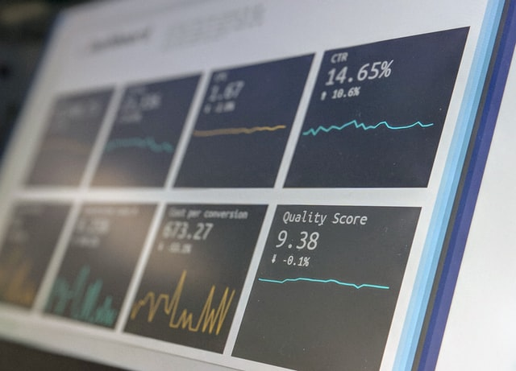

# Ghaith Khlifi
*An Aspiring Data Scientist | NLP Enthusiasm*

# Education
* Masters of Information system for deccsion support (Data Science), *ISG SOUSSE University*, 2018-2020
* Bachelors of Science (Computer science), *Kairaouan University*, 2014-2017

# [Project 1: Stock market forcasting using DL]

Photo by <a href="https://unsplash.com/@nick604?utm_source=unsplash&utm_medium=referral&utm_content=creditCopyText">Nick Chong</a> on <a href="https://unsplash.com/s/photos/stock-market?utm_source=unsplash&utm_medium=referral&utm_content=creditCopyText">Unsplash</a>
  
  
This project integrates various news source for performing forcasting for stock markets.
* **Python libraries used:** Keras, matplotlib, pandas and others.
* **Input:** Historical stock market data.
* **Output:** stock market Signals.

# [Project 2: Sentiment analysis of app reviews]

Photo by <a href="https://unsplash.com/@srd844?utm_source=unsplash&utm_medium=referral&utm_content=creditCopyText">Stephen Dawson</a> on <a href="https://unsplash.com/s/photos/sentiment-analysis?utm_source=unsplash&utm_medium=referral&utm_content=creditCopyText">Unsplash</a>
  

This project makes use of ***sentiment analysis*** of app user reviews coupled with ***recent deep learning techniques*** to classify reviews into different categories.
* **Python libraries used:** sklearn, Transformers, Pytorch
* **Input:** User app reviews
* **Output:** sentiments of positive, neutral and negative reviews

